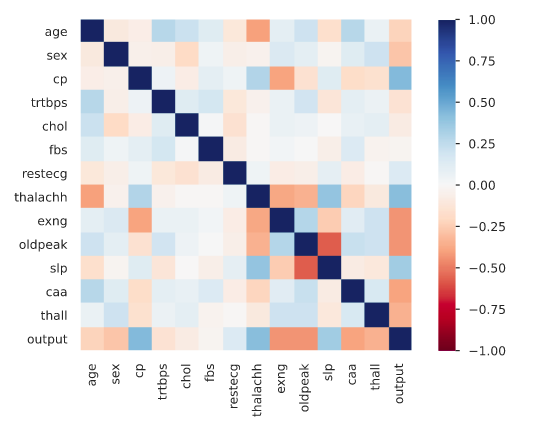
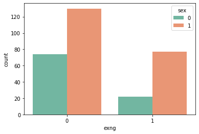
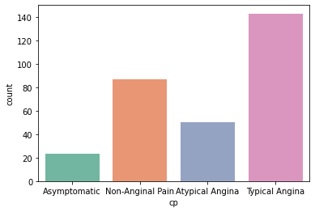
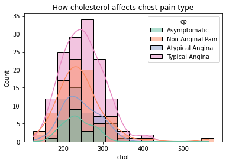
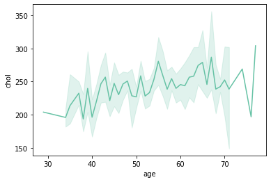
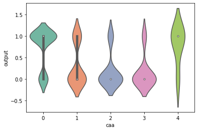
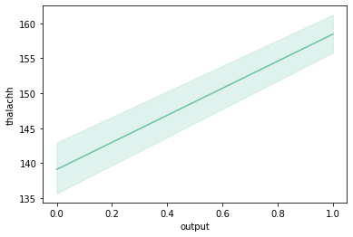

# Exploratory analysis on heart attack

## Data Description

	age : Age of the patient
	
	sex : Sex of the patient
	
	exng: exercise induced angina (1 = yes; 0 = no)
	
	ca: number of major vessels (0-3)
	
	cp : Chest Pain type chest pain type
		Value 1: typical angina
		Value 2: atypical angina
		Value 3: non-anginal pain
		Value 4: asymptomatic
	
	trtbps : resting blood pressure (in mm Hg)
	
	chol : cholestoral in mg/dl fetched via BMI sensor
	
	fbs : (fasting blood sugar > 120 mg/dl) (1 = true; 0 = false)
	
	rest_ecg : resting electrocardiographic results
	
		Value 0: normal 
		Value 1: having ST-T wave abnormality (T wave inversions and/or ST elevation or depression of > 0.05 mV) 
		Value 2: showing probable or definite left ventricular hypertrophy by Estes' criteria
	
	thalach : maximum heart rate achieved
	
	target :
		0= less chance of heart attack
		1= more chance of heart attack

## Statistical description of data is in report.html

<b>For Report</b> : <a href="https://github.com/Sb2001nov/HeartAttack-Analysis/blob/main/report.html">click</a>

## general statistical description

### pearson correlation



### exang induced on gender




    male = 1
    exercise induced angina have a high possibility in Male then female.

### Frequency of different type on chest pain


	
	Typical-Angina have the highest possibility of occurrence
	,also NON-Anginal pain have high possibility.

### How cholesterol affects chest pain type?



	individuals having chol around 200-275 have the most possibility of having chest pain.

### chol and age


	
	since age and chol have a +ve co-relation as the age inc. chol tends to inc.


### caa relation ship with chance of heart attack


	
	(0,4) have a significant high chance of heart attack.
	(1,2,3) have a significant low chance of heart attack.
	
###  How max heart rate affects the probability of having heart attack?



	There's positive correlation co-efficient of 0.421741 ("pearson") between them,
	so we can assume that having a higher heart rate is a factor contributing to heart attack.


### Model to predict heart attack

```py

train_data = data.drop(['output'], axis=1)

X_train, X_test, y_train, y_test = train_test_split(
        train_data, data['output'], random_state=0)

knn = KNeighborsClassifier(n_neighbors=4)
knn.fit(X_train, y_train)
prediction = knn.predict(X_test)

print(np.mean(prediction == y_test))

```

	accuracy of model => 0.6842105263157895 or 68.42%
